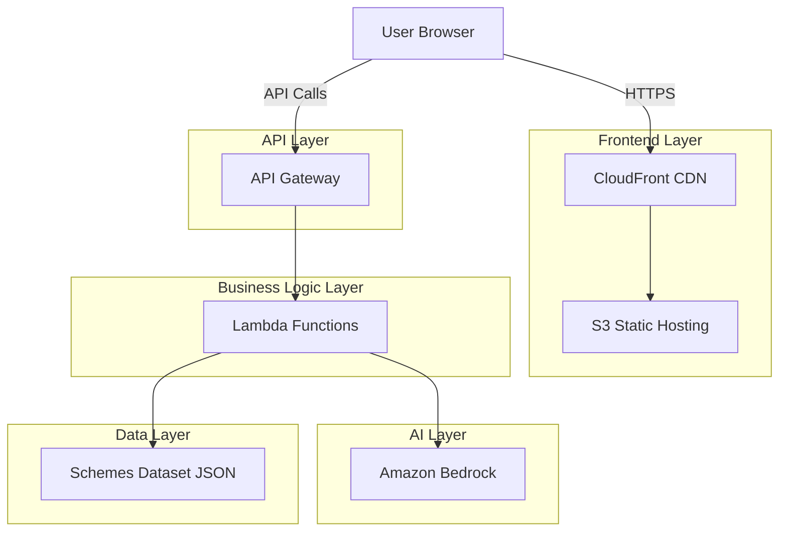

# Design Document: SahayAI

## Overview

SahayAI is a serverless web application built on AWS that connects Indian citizens with relevant government schemes through AI-powered personalization. The system follows a three-tier architecture: a React-based frontend for user interaction, AWS Lambda functions for business logic orchestration, and Amazon Bedrock for intelligent reasoning and natural language generation.

The core workflow involves:
1. User submits their socio-economic profile through a web form
2. Backend filters schemes from a static dataset based on profile criteria
3. Amazon Bedrock analyzes eligibility, generates document checklists, and provides application guidance
4. Results are presented to the user in their preferred language with confidence scores and disclaimers

The design prioritizes simplicity, cost-effectiveness, and extensibility while maintaining security and performance standards appropriate for a prototype serving 100+ concurrent users.

The system is designed as a prototype for hackathon demonstration and can be extended to production-grade scale with full RAG implementation using OpenSearch and embeddings.

## Architecture

### High-Level Architecture



### Component Architecture

The system is organized into distinct layers with clear separation of concerns:

**Frontend Layer:**
- React single-page application
- Hosted on S3 with CloudFront distribution
- Handles user input collection and result presentation
- Manages language selection and UI state

**API Layer:**
- API Gateway REST API
- Request validation and routing
- CORS configuration for frontend access
- Request/response transformation

**Business Logic Layer:**
- AWS Lambda functions (Node.js or Python)
- Scheme matching logic
- Bedrock service orchestration
- Response formatting and aggregation

**AI Layer:**
- Amazon Bedrock (Claude or similar model)
- Prompt engineering for eligibility analysis
- Document checklist generation
- Application steps generation
- Multilingual content generation

**Data Layer:**
- Static JSON file stored in S3 or embedded in Lambda
- Contains 10-15 government schemes with structured metadata
- Read-only access pattern

### Technology Stack

**Frontend:**
- React 18+ with TypeScript
- Tailwind CSS for styling
- Axios for API communication
- React Hook Form for input validation

**Backend:**
- AWS Lambda (Node.js 18+ or Python 3.11+)
- API Gateway REST API
- Amazon Bedrock (Claude 3 Sonnet or Haiku)
- AWS SDK for Bedrock integration

**Infrastructure:**
- AWS CloudFormation or AWS CDK for IaC
- S3 for static hosting and data storage
- CloudFront for CDN
- CloudWatch for logging and monitoring
- IAM for access control

**Development:**
- Git for version control
- ESLint/Prettier for code quality
- Jest for unit testing
- AWS SAM or Serverless Framework for local development

## Components and Interfaces

### Frontend Components

#### ProfileForm Component
**Responsibility:** Collect user socio-economic information

**Interface:**
```typescript
interface ProfileFormProps {
  onSubmit: (profile: UserProfile) => void;
  isLoading: boolean;
}

interface UserProfile {
  state: string;
  incomeRange: string;
  educationLevel: string;
  occupation: string;
  category: string;
  language: 'en' | 'hi';
}
```

**Behavior:**
- Renders form fields for all profile attributes
- Validates required fields before submission
- Displays validation errors inline
- Disables submission during API calls

#### SchemeResults Component
**Responsibility:** Display matched schemes with AI-generated insights

**Interface:**
```typescript
interface SchemeResultsProps {
  schemes: SchemeResult[];
  language: 'en' | 'hi';
}

interface SchemeResult {
  schemeId: string;
  schemeName: string;
  description: string;
  eligibilityReasoning: string;
  confidenceScore: number;
  requiredDocuments: string[];
  applicationSteps: string[];
}
```

**Behavior:**
- Renders each scheme as an expandable card
- Displays confidence score with visual indicator
- Shows eligibility reasoning prominently
- Lists documents and steps in structured format
- Displays responsible AI disclaimer

#### LanguageSelector Component
**Responsibility:** Allow users to choose output language

**Interface:**
```typescript
interface LanguageSelectorProps {
  currentLanguage: 'en' | 'hi';
  onLanguageChange: (language: 'en' | 'hi') => void;
}
```

**Behavior:**
- Renders language toggle (English/Hindi)
- Persists selection in component state
- Triggers re-rendering of content when changed

### Backend Components

#### API Handler (Lambda Function)
**Responsibility:** Orchestrate scheme discovery workflow

**Interface:**
```typescript
// Request
interface DiscoverSchemesRequest {
  profile: UserProfile;
}

// Response
interface DiscoverSchemesResponse {
  success: boolean;
  schemes: SchemeResult[];
  error?: string;
}
```

**Behavior:**
1. Validate incoming request payload
2. Invoke SchemeMatcher to filter relevant schemes
3. For each matched scheme, invoke BedrockService for AI analysis
4. Aggregate results and return formatted response
5. Handle errors and return appropriate status codes

#### SchemeMatcher Module
**Responsibility:** Filter schemes based on user profile

**Interface:**
```typescript
interface SchemeMatcher {
  findMatchingSchemes(profile: UserProfile): Scheme[];
}

interface Scheme {
  id: string;
  name: string;
  description: string;
  eligibilityCriteria: {
    states: string[];
    incomeRanges: string[];
    educationLevels: string[];
    occupations: string[];
    categories: string[];
  };
}
```

**Behavior:**
- Load schemes dataset from storage
- Apply filtering logic for each criterion
- Return schemes where ALL criteria match user profile
- Return empty array if no matches found

#### BedrockService Module
**Responsibility:** Interface with Amazon Bedrock for AI generation

**Interface:**
```typescript
interface BedrockService {
  generateEligibilityAnalysis(
    scheme: Scheme,
    profile: UserProfile,
    language: string
  ): Promise<EligibilityAnalysis>;
  
  generateDocumentChecklist(
    scheme: Scheme,
    profile: UserProfile,
    language: string
  ): Promise<string[]>;
  
  generateApplicationSteps(
    scheme: Scheme,
    profile: UserProfile,
    language: string
  ): Promise<string[]>;
}

interface EligibilityAnalysis {
  reasoning: string;
  confidenceScore: number;
}
```

**Behavior:**
- Construct prompts with scheme data, user profile, and language instruction
- Invoke Bedrock API with appropriate model parameters
- Parse and validate Bedrock responses
- Handle API errors and timeouts
- Return structured data for consumption by API handler

**Prompt Engineering Strategy:**
- Use structured prompts with clear instructions
- Include JSON schema for expected output format
- Specify language requirement explicitly
- Provide examples for consistency
- Request confidence score as percentage (0-100)

### Data Models

#### Scheme Dataset Structure

```json
{
  "schemes": [
    {
      "id": "pm-kisan",
      "name": "PM-KISAN",
      "description": "Income support for farmer families",
      "eligibilityCriteria": {
        "states": ["all"],
        "incomeRanges": ["0-50000", "50000-100000"],
        "educationLevels": ["any"],
        "occupations": ["farmer", "agricultural-worker"],
        "categories": ["general", "obc", "sc", "st"]
      },
      "officialUrl": "https://pmkisan.gov.in",
      "benefits": "₹6000 per year in three installments"
    }
  ]
}
```

**Dataset Characteristics:**
- 10-15 schemes covering diverse categories
- Structured eligibility criteria for programmatic filtering
- Includes metadata for AI context (description, benefits, URLs)
- Stored as static JSON file
- Versioned for future updates

#### API Request/Response Models

**POST /api/discover-schemes**

Request:
```json
{
  "profile": {
    "state": "Maharashtra",
    "incomeRange": "50000-100000",
    "educationLevel": "graduate",
    "occupation": "self-employed",
    "category": "general",
    "language": "en"
  }
}
```

Response:
```json
{
  "success": true,
  "schemes": [
    {
      "schemeId": "mudra-yojana",
      "schemeName": "Pradhan Mantri MUDRA Yojana",
      "description": "Micro-financing for small businesses",
      "eligibilityReasoning": "You are eligible because you are self-employed...",
      "confidenceScore": 85,
      "requiredDocuments": [
        "Aadhaar Card",
        "PAN Card",
        "Business Plan",
        "Income Certificate"
      ],
      "applicationSteps": [
        "Visit nearest bank or NBFC",
        "Fill MUDRA loan application form",
        "Submit required documents",
        "Wait for verification and approval"
      ]
    }
  ]
}
```

Error Response:
```json
{
  "success": false,
  "error": "Invalid profile data: state is required"
}
```

## Correctness Properties

*A property is a characteristic or behavior that should hold true across all valid executions of a system—essentially, a formal statement about what the system should do. Properties serve as the bridge between human-readable specifications and machine-verifiable correctness guarantees.*


### Property 1: Complete Profile Validation
*For any* user profile, if all required fields (state, income range, education level, occupation, category) are provided with non-empty values, then the system should enable scheme discovery; otherwise, the system should prevent discovery and indicate which fields are missing.
**Validates: Requirements 1.6, 1.7, 11.4, 11.5, 14.4**

### Property 2: Multi-Criteria Scheme Filtering
*For any* user profile and scheme dataset, the Scheme_Matcher should return only schemes where ALL eligibility criteria (state, income range, education level, occupation, category) match the user's profile attributes.
**Validates: Requirements 2.2, 2.3, 2.4, 2.5, 2.6, 2.8**

### Property 3: Empty Results Handling
*For any* user profile that matches no schemes in the dataset, the system should return an empty result set with an explanatory message.
**Validates: Requirements 2.7, 14.3**

### Property 4: Bedrock Invocation for AI Generation
*For any* matched scheme and user profile, the system should invoke the Bedrock_Service to generate eligibility reasoning, document checklist, and application steps.
**Validates: Requirements 3.1, 4.1, 5.1, 9.1, 9.2, 9.3**

### Property 5: Eligibility Reasoning Generation
*For any* matched scheme and user profile, the Eligibility_Analyzer should generate non-empty eligibility reasoning that references specific profile attributes that satisfy the scheme's criteria.
**Validates: Requirements 3.2, 3.3**

### Property 6: Confidence Score Range
*For any* eligibility analysis, the generated Confidence_Score should be a number between 0 and 100 (inclusive).
**Validates: Requirements 3.5**

### Property 7: Confidence Score Correlation
*For any* two user profiles matched against the same scheme, if profile A satisfies more eligibility criteria than profile B, then profile A's confidence score should be greater than or equal to profile B's confidence score.
**Validates: Requirements 3.6**

### Property 8: Document Checklist Structure
*For any* scheme and user profile, the Document_Generator should return a list (array) of document names, where the list content varies based on both the scheme requirements and the user's profile attributes.
**Validates: Requirements 4.2, 4.3, 4.4**

### Property 9: Application Steps Structure
*For any* scheme and user profile, the Application_Guide should return an ordered list of sequential steps that includes at least one URL or contact information element.
**Validates: Requirements 5.2, 5.3, 5.4**

### Property 10: Application Steps Customization
*For any* scheme with state-specific or category-specific application procedures, if two user profiles differ only in state or category, then the generated application steps should differ accordingly.
**Validates: Requirements 5.5**

### Property 11: Language-Specific Output
*For any* user profile and matched schemes, if the language preference is set to English, all generated text (reasoning, documents, steps) should be in English; if set to Hindi, all generated text should be in Hindi.
**Validates: Requirements 6.3**

### Property 12: Language-Specific Prompts
*For any* Bedrock_Service invocation, the prompt should include an explicit language instruction matching the user's language preference.
**Validates: Requirements 6.4**

### Property 13: Dataset Structure Completeness
*For any* scheme in the dataset, it should contain all required fields: id, name, description, eligibilityCriteria (with states, incomeRanges, educationLevels, occupations, categories), officialUrl, and benefits.
**Validates: Requirements 8.2, 8.3, 8.4, 8.5, 8.6, 8.7, 8.8, 8.9**

### Property 14: Dataset Access Performance
*For any* query to the Scheme_Matcher, the dataset should be accessible and return results within 1 second.
**Validates: Requirements 8.10**

### Property 15: Bedrock Prompt Data Inclusion
*For any* Bedrock_Service invocation, the prompt should include both the relevant scheme data and the user profile data.
**Validates: Requirements 9.6**

### Property 16: Bedrock Response Formatting
*For any* Bedrock_Service response, the system should parse the response and format it into the appropriate structured data type (string for reasoning, array for documents/steps, number for confidence score).
**Validates: Requirements 9.7**

### Property 17: Bedrock Error Handling
*For any* Bedrock_Service invocation that fails (unavailable or returns error), the system should log the error details and return a user-friendly error message to the user without exposing technical details.
**Validates: Requirements 9.4, 9.5, 14.1, 14.6**

### Property 18: Session Data Non-Persistence
*For any* user session, after the session ends, no personally identifiable profile data should remain stored in the system.
**Validates: Requirements 11.2**

### Property 19: Input Sanitization
*For any* user input received by the system, the input should be sanitized before being used in any processing or passed to external services.
**Validates: Requirements 11.3**

### Property 20: Response Time for Scheme Matching
*For any* valid user profile submission, the system should return matching schemes within 5 seconds.
**Validates: Requirements 12.1**

### Property 21: Response Time for Eligibility Analysis
*For any* eligibility analysis generation, the system should complete processing within 10 seconds.
**Validates: Requirements 12.2**

### Property 22: Bedrock Timeout Handling
*For any* Bedrock_Service invocation that exceeds 8 seconds, the system should implement timeout handling and return an appropriate error response.
**Validates: Requirements 12.5**

## Error Handling

### Error Categories

**Validation Errors:**
- Missing required profile fields
- Invalid field values (e.g., unrecognized state, invalid income range format)
- Malformed request payloads

**Response:** HTTP 400 Bad Request with specific field-level error messages

**Service Errors:**
- Bedrock API unavailable
- Bedrock API timeout
- Bedrock API rate limiting
- Bedrock API returns malformed response

**Response:** HTTP 503 Service Unavailable with user-friendly message suggesting retry

**Data Errors:**
- Dataset file not found or corrupted
- Scheme data missing required fields

**Response:** HTTP 500 Internal Server Error with generic error message (log details internally)

**No Results:**
- User profile matches no schemes

**Response:** HTTP 200 OK with empty schemes array and explanatory message

### Error Handling Strategy

**Frontend:**
- Display validation errors inline with form fields
- Show service errors in a prominent alert/banner
- Provide retry buttons for transient errors
- Maintain user input state during errors (don't clear form)
- Log errors to browser console for debugging

**Backend:**
- Validate all inputs at API Gateway and Lambda layers
- Implement exponential backoff for Bedrock retries (max 2 retries)
- Set timeout of 8 seconds for Bedrock invocations
- Log all errors to CloudWatch with context (request ID, user profile hash, error details)
- Never expose internal error details (stack traces, AWS errors) to users
- Return consistent error response format

**Error Response Format:**
```json
{
  "success": false,
  "error": "User-friendly error message",
  "errorCode": "VALIDATION_ERROR | SERVICE_ERROR | NO_RESULTS",
  "details": {
    "field": "state",
    "message": "State is required"
  }
}
```

### Responsible AI Disclaimer

The system will display the following disclaimer prominently on the results page:

**English:**
> "This analysis is generated by AI and should be used as guidance only. Eligibility determinations are estimates based on the information provided. Please verify all information with official government sources before applying. The confidence score indicates the AI's certainty level but is not a guarantee of eligibility."

**Hindi:**
> "यह विश्लेषण AI द्वारा तैयार किया गया है और केवल मार्गदर्शन के रूप में उपयोग किया जाना चाहिए। पात्रता निर्धारण प्रदान की गई जानकारी के आधार पर अनुमान हैं। कृपया आवेदन करने से पहले सभी जानकारी को आधिकारिक सरकारी स्रोतों से सत्यापित करें। विश्वास स्कोर AI की निश्चितता के स्तर को दर्शाता है लेकिन पात्रता की गारंटी नहीं है।"

The disclaimer will:
- Appear at the top of the results section
- Use a distinct visual style (border, background color, icon)
- Remain visible while scrolling through results
- Be included in both English and Hindi versions

## Testing Strategy

### Dual Testing Approach

The testing strategy employs both unit tests and property-based tests to ensure comprehensive coverage:

**Unit Tests:** Focus on specific examples, edge cases, and integration points
- Specific profile examples (e.g., farmer in Maharashtra with low income)
- Edge cases (empty dataset, all fields missing, special characters in input)
- Error conditions (Bedrock timeout, malformed responses)
- Integration between components (API handler → SchemeMatcher → BedrockService)

**Property-Based Tests:** Verify universal properties across all inputs
- Generate random user profiles and verify validation logic
- Generate random scheme datasets and verify filtering correctness
- Generate random Bedrock responses and verify parsing
- Test properties with minimum 100 iterations per test

Together, these approaches provide both concrete validation (unit tests) and comprehensive input coverage (property tests).

### Property-Based Testing Configuration

**Library Selection:**
- **JavaScript/TypeScript:** fast-check
- **Python:** Hypothesis

**Configuration:**
- Minimum 100 iterations per property test
- Each test tagged with comment referencing design property
- Tag format: `// Feature: sahayai, Property {number}: {property_text}`

**Example Property Test Structure (TypeScript with fast-check):**

```typescript
// Feature: sahayai, Property 1: Complete Profile Validation
test('complete profiles enable discovery, incomplete profiles prevent it', () => {
  fc.assert(
    fc.property(
      fc.record({
        state: fc.string({ minLength: 1 }),
        incomeRange: fc.string({ minLength: 1 }),
        educationLevel: fc.string({ minLength: 1 }),
        occupation: fc.string({ minLength: 1 }),
        category: fc.string({ minLength: 1 }),
        language: fc.constantFrom('en', 'hi')
      }),
      (profile) => {
        const result = validateProfile(profile);
        expect(result.isValid).toBe(true);
        expect(result.canDiscoverSchemes).toBe(true);
      }
    ),
    { numRuns: 100 }
  );
});
```

### Test Coverage Requirements

**Unit Test Coverage:**
- ProfileForm component: input validation, submission handling
- SchemeResults component: rendering, language switching
- SchemeMatcher: filtering logic for each criterion
- BedrockService: prompt construction, response parsing, error handling
- API Handler: request validation, orchestration, error responses

**Property Test Coverage:**
- All 22 correctness properties must have corresponding property tests
- Each property test must reference its design document property number
- Properties related to AI generation (5, 7, 8, 9, 10) may use mocked Bedrock responses

**Integration Test Coverage:**
- End-to-end flow: profile submission → scheme matching → AI generation → results display
- Error scenarios: Bedrock unavailable, invalid input, no matching schemes
- Language switching: verify all content updates to selected language

### Testing Tools and Infrastructure

**Frontend Testing:**
- Jest for unit tests
- React Testing Library for component tests
- fast-check for property-based tests
- Mock Service Worker (MSW) for API mocking

**Backend Testing:**
- Jest (Node.js) or pytest (Python) for unit tests
- fast-check (Node.js) or Hypothesis (Python) for property-based tests
- AWS SDK mocking for Bedrock service tests
- LocalStack for local AWS service emulation

**CI/CD Integration:**
- Run all tests on every commit
- Require 80%+ code coverage for merge
- Run property tests with 100 iterations in CI
- Run extended property tests (1000 iterations) nightly

### Mock Data Strategy

**Scheme Dataset Mock:**
Create a test dataset with 5-10 schemes covering diverse criteria combinations to enable thorough testing without requiring the full 10-15 production schemes.

**Bedrock Response Mocks:**
Create deterministic mock responses for Bedrock to enable fast, reliable property tests without actual API calls. Include variations for different languages, confidence scores, and error scenarios.

**User Profile Generators:**
Use property-based testing libraries to generate random but valid user profiles covering all possible combinations of states, income ranges, education levels, occupations, and categories.
